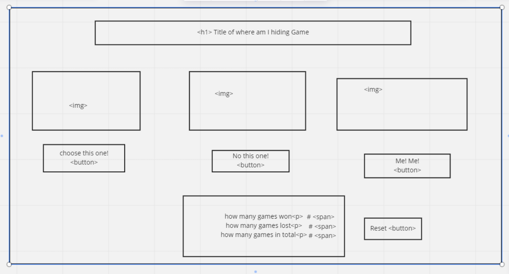

## The Golden Rule:

🦸 🦸‍♂️ `Stop starting and start finishing.` 🏁

If you work on more than one feature at a time, you are guaranteed to multiply your bugs and your anxiety.

## Making a plan

1. **Make a drawing of your app. Simple "wireframes"**
1. **Look at the drawing and name the HTML elements you'll need to realize your vision**
1. **Look at the drawing and imagine using the app. What _state_ do you need to track?**
1. **For each HTML element ask: Why do I need this? (i.e., "we need div to display the results in")**
1. **Once we know _why_ we need each element, think about how to implement the "Why" as a "How" (i.e., `resultsEl.textContent = newResults`)**
1. **Find all the 'events' (user clicks, form submit, on load etc) in your app. Ask one by one, "What happens when" for each of these events. Does any state change? Does any DOM update?**
1. **Think about how to validate each of your features according to a Definition of Done. (Hint: console.log usually helps here.)**
1. **Consider what features _depend_ on what other features. Use this dependency logic to figure out what order to complete tasks.**

Additional considerations:

-   Ask: which of your HTML elements need to be hard coded, and which need to be dynamically generated?
-   Consider your data model.
    -   What kinds of objects (i.e., Dogs, Friends, Todos, etc) will you need?
    -   What are the key/value pairs?
    -   What arrays might you need?
    -   What needs to live in a persistence layer?
-   Is there some state we need to initialize?
-   Ask: should any of this work be abstracted into functions? (i.e., is the work complicated? can it be reused?)

\*\*HTML Elements

<h1> title of page
3  with ids - to show the user the visual choices -classList add and remove
1  hidden that appears when clicked- to show the user the correct answer after they've chosen-  class that's added using a Math.random array
3 <button> with id for choice of img during the game- for the user to make their choice - add.EventListener('click')
3 
 with ids with 1  with id inside of each one- to display the results of if their choice was correct, incorrect, and the total number of games played display.textcontent of correct, incorrect answers and total games corectAnswer++, totalGames++

\*\*State
the counter of correct guesses increases
the counter of incorrect guesses increases
the counter of total games increases
the hiding spot string thats chosen from the array at random
